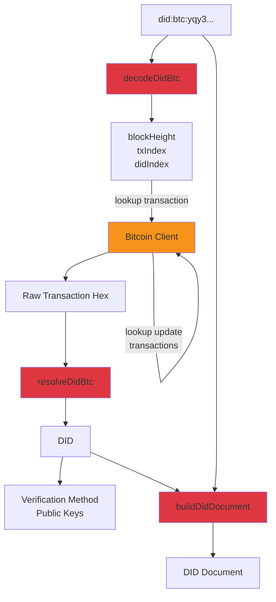
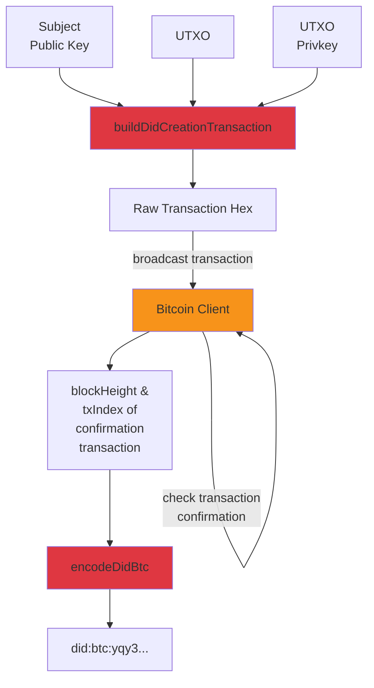

# did:btc SDK

This repository contains a software development kit that implements the [did:btc Method Specification](https://microstrategy.github.io/did-btc-spec/), whereby `did:btc` DIDs (Decentralized Identifiers) are created, updated, and resolved using bitcoin transactions. It is written in Typescript and intended for use in both backend (e.g. Node.js) and browser-based environments.

The key pieces of functionality include:

- **Creation**: Create a single DID or a batch of DIDs in a single transaction.
- **Resolution**: Resolve a DID from its creation transaction and any subsequent update transactions.
- **Update/Deactivation**: Update or deactivate a single DID or a batch of DIDs or any subset within.
- **DID Encoding**: Encode a `did:btc` identifier based on the position of the creation transaction within the blockchain.
- **DID Decoding**: Decode a `did:btc` identifier to determine its position in the blockchain.

## API Documentation

Documentation for the methods and data structures in this SDK are currently available at <https://microstrategy.github.io/did-btc-spec/sdk/docs/>.

## Usage

This SDK is intended to be used within an application or environment that interacts with the bitcoin blockchain - it does not include a bitcoin node or wallet or a built-in way to interact with one. Rather, it is designed to work with any bitcoin client that can fetch transactions from and (optionally) broadcast transactions to the bitcoin network in their raw hex format. Such clients may include:

- [Bitcoin Core](https://bitcoincore.org/) and its [getrawtransaction](https://developer.bitcoin.org/reference/rpc/getrawtransaction.html) and [sendrawtransaction](https://developer.bitcoin.org/reference/rpc/sendrawtransaction.html) RPC methods.
- Electrum and its [blockchain.transaction.get](https://electrumx.readthedocs.io/en/latest/protocol-methods.html#blockchain-transaction-get) and [blockchain.transaction.broadcast](https://electrumx.readthedocs.io/en/latest/protocol-methods.html#blockchain-transaction-broadcast) protocol methods.
- Third party block explorer APIs such as [Blockstream's Esplora](https://github.com/Blockstream/esplora/blob/master/API.md) or [mempool.space](https://mempool.space/docs/api/rest).

Furthermore, creating bitcoin transactions to create or update DIDs requires a wallet with private keys and available UTXOs to pay for transaction fees. The SDK does not manage wallets or private keys, so it is up to the developer to ensure that the wallet is properly funded and that the private keys are kept secure.

### Resolving a DID

[Resolving a DID](https://microstrategy.github.io/did-btc-spec/#read-resolve) refers to the process of decoding a `did:btc` identifier and fetching the corresponding transaction(s) from the blockchain. The transaction is then parsed to extract the DID information, which can be used to build a [DID Document](https://www.w3.org/TR/did-core/#dfn-did-documents) which includes a list of [Verification Methods](https://www.w3.org/TR/did-core/#verification-methods) by which the [DID Subject](https://www.w3.org/TR/did-core/#dfn-did-subjects) can assert the validity of a message, authenticate as themselves, or perform other actions that require verification.

This process uses the following methods from the SDK, which are illustrated in the sequence diagram below.

- `decodeDidBtc`
- `resolveDidBtc`
- `buildDidDocument`



The following code example demonstrates how to resolve a `did:btc` identifier:

```javascript
import { decodeDidBtc, resolveDidBtc } from '@microstrategy/did-btc-sdk';

const exampleDidId = 'did:btc:yqy3-8qmr-qpqq-ckwd-ye';
const decodedDidId = decodeDidBtc(exampleDidId);
console.log(decodedDidId);
// {
//   network: 'mainnet',
//   blockHeight: 123456,
//   txIndex: 123,
//   didIndex: 1,
// }
const { didIndex } = decodedDidId;

let txHex; // the transaction hex fetched from the blockchain using the decoded DID
let updateTxHex; // the transaction hex of an update reveal transaction, if one exists

const did = resolveDidBtc([txHex, updateTxHex], didIndex);
```

#### Getting a DID Document

After resolving a DID, you can use the `buildDidDocument` function to build a DID Document according to the [W3C DID Specification](https://www.w3.org/TR/did-core/#dfn-did-documents).

```javascript
import { buildDidDocument } from '@microstrategy/did-btc-sdk';

const didDocument = buildDidDocument(did, exampleDid);
console.log(didDocument);
// {
//   "@context": [
//     "https://www.w3.org/ns/did/v1",
//     "https://w3id.org/security/multikey/v1"
//   ],
//   "id": "did:btc:yqy3-8qmr-qpqq-ckwd-ye",
//   "controller": "did:key:z6DtU6TwakgQVMw6fisdMtebcPRgjofZsvZCtnUS5N3n456d",
//   "verificationMethod": [
//     {
//       "id": "did:btc:yqy3-8qmr-qpqq-ckwd-ye#key-0",
//       "controller": "did:btc:yqy3-8qmr-qpqq-ckwd-ye",
//       "type": "Multikey",
//       "publicKeyMultibase": "z6MkpicmaHUuxCL3zBCoMnkWqGLZThDUiJsTajm8iMrhfvPc"
//     }
//   ],
//   "authentication": [
//     "did:btc:yqy3-8qmr-qpqq-ckwd-ye#key-0"
//   ],
//   "assertion": [
//     "did:btc:yqy3-8qmr-qpqq-ckwd-ye#key-0"
//   ]
// }
```

### Creating a DID

[Creating a DID](https://microstrategy.github.io/did-btc-spec/#create) refers to the process of creating a new `did:btc` identity by broadcasting a bitcoin transaction to the blockchain. This transaction includes the public key(s) of the DID subject(s) and a set of flags that indicate how the public key(s) can be used in the future. Once the transaction is confirmed on chain, a `did:btc` identifier can be created and used by others to resolve the DID.

This process uses the following methods from the SDK, which are illustrated in the sequence diagram below.

- `buildDidCreationTransaction`
- `encodeDidBtc`



The following code example demonstrates how to create a DID,

```javascript
import { buildDidCreationTransaction, prependCodecToKey, VERIFICATION_RELATIONSHIP_FLAGS } from '@microstrategy/did-btc-sdk';

let utxo = { // a p2tr UTXO to pay for the transaction
  txid: Buffer.from('48452f42ac0accd63a0467f7e0406945320061bd19971bf34478582d76e85dbe', 'hex'), // the transaction id of the UTXO,
  vout: 0 // the output index of the UTXO,
  amount: 4131295, // the amount of the UTXO in satoshis,
};
let privkey: Buffer; // the keypath private key of the UTXO

let ed25519Pubkey: Buffer; // an ed25519 public key of the DID subject
// convert the ed25519 public key to a multikey
const multikey = prependCodecToKey(ed25519Pubkey, 'ed25519-pub');

const verificationRelationshipFlags = VERIFICATION_RELATIONSHIP_FLAGS.AUTHENTICATION | VERIFICATION_RELATIONSHIP_FLAGS.ASSERTION; // flags to indicate that this public key can be used for authentication and assertion
const satsPerVbyte = 123; // the fee rate in satoshis per vbyte, this can be fetched from a fee estimation service or API

const { txHex } = buildDidCreationTransaction(
  multikey,
  walletUtxos: [{ utxo, privkey }],
  verificationRelationshipFlags,
  satsPerVbyte,
);
```

The `txHex` can then be broadcast to the bitcoin network using the client of your choice.

#### Encoding a DID id

Once the transaction is confirmed, the DID id can be created and resolved by others.

```javascript
import { encodeDidBtc } from '@microstrategy/did-btc-sdk';

const blockHeight = 123456; // the height of the block confirming the creation transaction
const txIndex = 123; // the index of the confirmation transaction in the block

const didId = encodeDidBtc({
  network: 'mainnet',
  blockHeight,
  txIndex,
});
console.log(didId); // did:btc:rqy3-8qmr-q4f4-z9z
```

#### Creating a batch of DIDs

A batch of DIDs can be created in a single transaction by providing an array of public keys and private keys to the `buildDidCreationTransaction` function, this saves on transaction fees and blockchain space.

```javascript
import {
  buildBatchDidCreationTransactions,
  codecs,
} from '@microstrategy/did-btc-sdk';

let ed25519Pubkeys; // an array of ed25519 public keys of the DID subjects
const codec = codecs['ed25519-pub'];

const { revealTransaction } = buildBatchDidCreationTransactions({
  utxo,
  privkey,
  satsPerVByte,
  pubkeys: ed25519Pubkeys,
  verificationRelationshipFlags,
  codec,
});
const { txHex } = revealTransaction;
```

## Considerations

### Buffer

This SDK, as well as its dependency [bitcoinjs-lib](https://github.com/bitcoinjs/bitcoinjs-lib) uses the [Buffer](https://nodejs.org/api/buffer.html) class from Node.js to handle binary data. If you are using this SDK in an environment other than Node.js, such as a browser, you may need to use a polyfill or a library like [buffer](https://www.npmjs.com/package/buffer) to provide this class.

### Security

The SDK takes private keys as parameters and uses them to sign bitcoin transactions and it is important to keep them secure. The SDK does not store or persist any private keys, so it is up to the developer to manage the lifecycle of the private keys and ensure that they are not leaked or compromised.

Although these keys are expected to control some funds on chain for the purpose of paying transaction fees and creating new outputs, it is recommended to keep the value of these funds to a minimum. Developers should use a separate wallet for managing funds of significant value and to only use the keys provided to the SDK for the purpose of creating and updating DIDs.

### Blockchain Limitations

The bitcoin network and blockchain have limitations that can affect the creation, resolution, and updating of `did:btc` DIDs. Transactions may take hours or days to confirm on chain, and in extreme cases may never confirm. Blocks may be orphaned and the blockchain may be reorganized. For this reason, `did:btc` identifiers should not be encoded or shared until the creation transaction has been confirmed on chain at a depth at least 6 and preferably 100 blocks (as recommended by the [BIP136 specification](https://github.com/bitcoin/bips/blob/master/bip-0136.mediawiki#abstract)).

For more detail, see https://microstrategy.github.io/did-btc-spec/#considerations.

### Implementation Limitations

This section lists known limitations of the current implementation of the SDK.

#### ScriptPubKey Types

Although the bitcoin protocol allows a wide variety of script types for use in [ScriptPubKeys](https://river.com/learn/terms/s/scriptpubkey/) to lock and spend UTXOs, the SDK currently only uses [Pay-To-Taproot](https://river.com/learn/terms/p/pay-to-taproot-p2tr/) scripts that can be spent using [key path spending](https://github.com/bitcoin/bips/blob/master/bip-0341.mediawiki#user-content-Taproot_key_path_spending_signature_validation) with a single private key. Any UTXOs used to fund transactions must be of this type, and any UTXOs created by the SDK - such as DID UTXOs - will also be of this type.

This means that the SDK does not currently support complex spending conditions to define the control of a DID or batch of DIDs, such as multisignature or hash-locked scripts.

#### Supported Keys

Currently, this SDK only supports creating and resolving DIDs whose verification methods use either [Ed25519](https://ed25519.cr.yp.to/) or [secp256k1](https://en.bitcoin.it/wiki/Secp256k1) keys. Support for other curves and key types may be added in the future.
